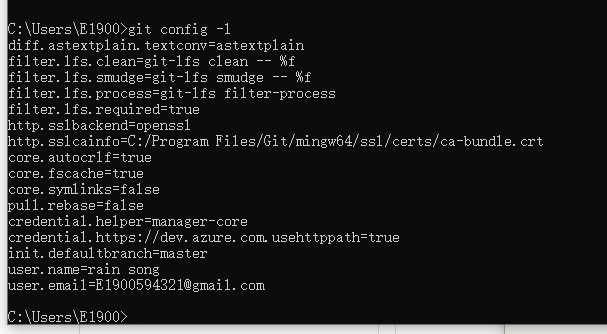

# Git

### 简介

1.    Git 是一个分布式的版本控制系统。

2.    工作区：就是电脑中能看到的目录，在这个目录中进行修改，增删等工作。

      暂存区：(stage) 通过git add 提交。暂存区在版本库.git 中。

      版本库：版本库就是.git 那个隐藏的文件。

3.    注意一点，git跟踪管理的，不是文件，而是对文件的修改。git将修改存放到stage暂存区。

### 安装

1.    windows 下载安装后。能够运行git bash 就是成功了。

2.    需要配置git config 变量。

      这个config 是git 自己的，在cmd 命令行中输入：

      1.    git config --global user.name 
      2.    git config --global user.email 

3.    之后可以用git config -l 来list所有的配置

4.    

5.    因为git 是分布式版本控制系统，因此必须配置个人的信息。所以

      git config --global user.name 和email 是必须要有的。

### 创建版本库

1.    版本库又叫仓库，repository。就是一个可以被git 管理的目录，目录下所有的文件的变化，都会被git 跟踪。

2.    创建方式：

      先创建一个空目录，进入空目录后，用命令行键入命令：

      git init就可以了。

      在windows 下，可以借助power shell，更方便。

      可以看到出现了一个隐藏文件.git，这个文件是git 用来跟踪管理这个目录的。

      

      在一个非空的文件夹内建立git repository也是可以的。


### 把文件添加到版本库

1.    所有的版本控制系统，都只能跟踪文本文件的改动。txt，网页，程序代码等等。

      这里的跟踪改动是指，在某一行加了什么，删除了什么这种细节都能够跟踪记录。

      而非文本文件，也能管理，但是不能跟踪。

2.    注意，不能用windows的记事本来编辑文本文件，因为编码问题。用visual studio code。

3.    添加文件：

      1.    要把想添加的文件放到被git 管理的那个目录下，不然git 找不到文件。

      2.    添加：

            在被管理的目录启动powershell：

            git add ......txt

            用tab键可以一个一个向下翻文件，就不用输入了。

            这一步没有返回，无返回，就是好事

      3.    提交：

            git commit -m "写入想写入的comment 的信息"

            -m 是写入提交的说明，这样方便在历史记录中寻找。手动输入时，在文件名子前要有 .\并且中间没有空格直接是文件名，文件名要有拓展名。

            add 和commit 是不同的行为。add 是添加文件到commit 区，暂存区，

            ```
              (use "git add <file>..." to update what will be committed)
              (use "git restore <file>..." to discard changes in working directory)
            ```

            而commit 是提交到库，也就是提交到当前的分支。可以认为，commit 是将所有被修改了的文件进行了一次整体的updata。

      总结：初始化一个目录成为git 目录：git init

      ​			添加一个文件 git add 然后用tab

      ​			提交一个文件 git commit -m ""

### git status

1.    当一个新文件被add和commit 后，他就算是正式成为了仓库中文件中的一个，并会被git 跟踪管理。

2.    当继续修改文件

      1.    git status 用来查看所有的变化。

            git status 是一个核心命令，他将显示：

            1.    changes not staged for commit

            2.    changes to be committed

            3.    被修改的文件是哪些，也可以用 git restore  来丢弃掉修改，只要未add都可以改回来。

                  这里的restore 有两重，第一重是从stage区撤出：

                  要加 --stage + filename。如：
            
                  
            
                  
            
                  第二重是撤出工作区文件的所有的修改。
            
            4.    git diff 用来看某一个文件的变化。
            
                  绿色的为改变后的样子，白色的为没有改变的部分，红色为修改前的样子。
            
            5.    在add 之后，文件也可以用git store 再取消add。

3.    git status 可以查看整个仓库的状态，查看某个文件被修改了，而git diff 可以查看文件具体是如何被修改的。git diff 本质上看的是，工作区的文件和版本库中最新提交的那个文件之间的区别。

### 版本回退

1.    commit 文件进行了存档，可以进行版本的回退。

2.    用 git log 来查看版本存档，git log --pretty= oneline

      这样可以一行显示，信息省略。这里的存档，是提交后，commit后的存档。

      命令参数 --pretty=oneline，中间是没有空格的。

3.    git用head来表示当前版本。版本回退，可以理解为将head指针重新指向另外的commit 的版本。

      使用git reset --hard HEAD^ 

      或者是git reset --hard HEAD~2

      或者是git reset --hard 1083sdegtds（某个commit版本的sha，也就是commit id）

4.    如果还是后悔了，可以用git reflog来按照时间线来查看每一次提交的commit id。再配合git reset --hard commit id就可以将HEAD 指针指向相应位置了。

      reflog 可以显示所有的reset相关命令和所有出现过的版本。

### 删除文件

1.    先手动将某文件从工作区删除。

2.    再git rm 文件名。

3.    git commit即可。

4.    如果是误删文件，只要版本库没有提交，那么就可以从版本库中取回：

      

      checkout 命令用于从版本库中提取某文件到工作区。

      git checkout -- 文件名

### 远程仓库

1.    github 作为远程托管代码的服务器。

2.    本地git 仓库和远程github 之间通信用ssh 进行加密。

3.    创建一个ssh密钥对：

      1.    打开git bash，创建ssh key：

            ssh-keygen -t rsa -C"email"

            这个email要填写github的email。

      2.    注意，-C与email之间没有空格。

            生成的ssh文件夹在windows 的用户目录下，为隐藏文件.ssh

      3.    将ssh中的公钥，粘贴给网站。

4.    添加远程库：

      1.    添加远程仓库的本质是，在远程代码库中让两个库进行同步。

            也可以叫做关联远程库，是指localgit文件夹和远程git文件夹同步。是两个文件夹之间的行为，而不是账户之间的行为。

      2.    先在github上创建一个同名repo

      3.    在本地仓库中运行：

            git remote add origin git@github.com：自己的账户名/刚创建的repo.git

            注意冒号的位置。

            即可。如图：

            

            这样，就添加了远程的仓库。远程库的名字为origin，这个是默认的叫法。

5.    把本地库推送给远程库：

      1.    用命令git push，把当前本地的分支，master推给远程。

      2.    如果远程库是空的，那么用命令：

            git push -u origin master

            其中origin是远程库的名字，master 是当前的分支，-u参数是指，将本地master和远程master进行关联。

            同时，第一次推送会有密钥的warning，直接yes就可以。

      3.    第一次推送后，接下来的推送可以用简化命令。

            当想进行推送的时候：

            git push origin master即可。

6.    删除远程库：

      1.    删除远程库，并不是把远程代码库删除，而是删除origin，也就是本地库和远程库的关联。

      2.    首先，查看本地库关联的信息：

            git remote -v

            即可。

      3.    如果确定删除：

            git remote rm origin。

            origin为通常的名字。

7.    从远程库克隆：

      1.    首先建立一个空的文件夹

      2.    进行git init，将该文件夹被git 管理

      3.    进行clone：

            命令为：git clone git@github.com:用户名/仓库名.git

            注意：冒号后没有空格。

            

8.    git 进行clone 的地址有两种，ssh，或者是https

### 分支管理

1.    分支管理的意义在于，我可以创建一个自己的分支，将不断未完工的代码进行上传而又不影响别人的工作。这些分支对别人并不可见，直到合并。

2.    每次提交，时间线就向前推进一步。而如果只有一个分支，那么就只是一条线。就是master，主分支。

      HEAD 并不是指向提交的，HEAD指向的是master，如版本回退

      git reset --hard HEAD^, HEAD的指向变了。

3.    最开始时候，master是一条线，git 用master 指向最新的提交，在用HEAD 指向master。

      创建一个新的分支，dev，这个dev也是一个指针，指向master 的提交，也就是最新的提交。

      然后，HEAD 指向dev，而不是master了。

      然而，从现在开始，每一次提交，master不再动了，动的是dev。

      当所有的工作完成后，可以将dev 和master 进行合并。如何合并呢，就是将master 指向dev的最新提交。

4.    创建并切换分支：

      ​		git checkout -b dev

      ​		这个命令是两个命令的合并：

      ​		git branch dev

      ​		git checkout dev

      ​		查看当前分支用命令：

      ​		git branch

      所有提交的内容，都是dev分支上的，原分支master 并没有变化。

      切换分支，也可以用switch：

      git switch -c dev, 创建一个新的分支

      git switch dev，切换已有分支。

5.    合并分支：

      1.    合并分支，是把某个分支，合并到当前分支。因此，如果要合并到master，先要切换到master分支：

            git checkout master

            git merge dev

            

            即可。

            fast forward 是指，master 的指针指向了dev 的最新提交。

      2.    删除dev 分支：

            git branch  -d dev

            即可。

      3.    使用参数 --no-ff -m ：

             git merge --no-ff -m "merge with no-ff" dev

            可以将分支信息保留，在git log 中可以体现出来。因为这种merge，是要有commit的，所以有参数-m。

            --no-ff是可以看出来曾经合并过的，而不带这个参数则看不出来曾经合并。

      4.    真正工作时，分三层，一层为master，为发布新的版本

            二层为dev，进行不断的与员工的修改进行merge

            三层为个别员工的分支。

### 解决冲突

1.    两个分支合并时，如果两个分支分别都进行了修改，并都提交了，而修改不同，那么合并时就会发生冲突。

2.    需要将待合并的分支进行修改，跟上master 的修改变化，然后再增添一些修改，才能合并。

3.    查看不同，用cat + 文件名即可。

4.    


### 用分支处理bug

1.    如果是在dev 上进行的工作，那如果没有完成是不可以提交的。而如果此时要进行别的工作，就需要将现场保存起来。

2.    使用stash功能：

      git stash 即进行了现场保存。

3.    恢复现场：

      git stash list
      
      git stash pop
      
      或者是，git stash apply，然后git stash drop。
      
      
      
4.    如何单独的复制一次提交：

      单独复制一次提交的意思就是，在不同的分支上，将某一个分支上的某一次修改的提交，复制到本分支上。这样来节省时间。

      1.    到某个分支下，复制下某次提交的commit id。

      2.    运行git cherry-pick commit id

            如图：

            

            在log 模式下，退出按q即可。

注意：当进行分支切换的时候，如果本分支有不能提交的修改，那么需要进行stash，不然，这些修改会被默认带到新的分支中。只有stash之后，新打开的分支才是最后一次提交的分支。

### 多人协作

1.    推送分支：

      推送分支，就是把该分支上的所有本地提交推送到远程库上。

      推送时要指定本地分支，这样git 会把本地分支推送到远程库的对应的分支上。

      git push origin dev

      git push origin master

      就是进行推送

2.    抓取分支：

      当clone 时，默认只clone 一个master 分支。

      开发时，创建本地dev 与远程的dev相对应：

      git checkout -b dev origin/dev

      这个命令需要远程已经有了dev 分支，因此才能够建立本地的dev分支与远程分支对应。

      所以，先由某个人将他的 dev 推送给远端。远端就相当于有了dev。

      其他人再git pull

      然后git checkout -b dev origin/dev即可。

3.    git pull

      如果出现git pull 的失败，是因为没有指定本地分支与远端分支的链接。

      git branch --set-upstream-to=origin/dev dev

      这样，就让远端的dev 和本地的dev 对应了。

总结： git pull 用于远端库与本地库的合并，用于更新本地库。


### 标签

1.    标签永远与某一次的提交，commit 相关：

      默认为本branch的最后一次commit

      git tag name即可。

2.    给某一个特殊的commit 进行标签：

      git tag name commit id

3.    git tag，按字母顺序列出标签。

      git show tagname，显示信息。

4.    给标签做说明：

      git tag -a name -m "blalblalbls" commit id

      

5.    删除标签：

      git tag -d tagname

      

      推送标签：

      git push origin tagname   git push origin --tags(全部未推送tag)

      因为tagname是标记给commit 的，因此不存在分支的问题。
      
      git push origin :refs/tags/tagname删除标签。


